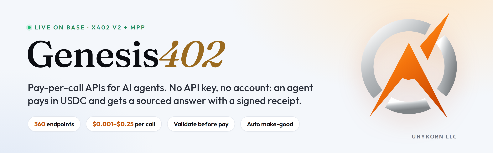

<p align="center">
  
</p>

<p align="center">
  <a href="https://www.npmjs.com/package/genesis402-mcp"></a>
  <a href="https://registry.modelcontextprotocol.io/v0/servers?search=genesis402"></a>
  <a href="https://glama.ai/mcp/connectors/io.github.FTHTrading/genesis402-mcp"></a>
  <a href="https://smithery.ai/servers/kevanbtc/genesis402-mcp"></a>
  <a href="https://mcpservers.org/servers/fthtrading/genesis402-agent-kit"></a>
  <a href="https://8004scan.io/agents/base/95721"></a>
  <a href="https://twin.unykorn.org/status"></a>
  
</p>

<p align="center">
  <b>360 pay-per-call APIs for AI agents over x402 and MPP.</b><br>
  USDC on Base · $0.001 to $0.25 a call · no API key · no account.<br>
  Every response names its sources and carries an evidence hash. A paid call that is not delivered is credited automatically.
</p>

<p align="center">
  <a href="https://twin.unykorn.org">Rail</a> ·
  <a href="https://twin.unykorn.org/catalog">Catalog</a> ·
  <a href="https://twin.unykorn.org/status">Live status</a> ·
  <a href="https://twin.unykorn.org/receipts">Receipts</a> ·
  <a href="https://unykorn.ai">UnyKorn</a>
</p>

---

## Connect in 30 seconds

### Hosted MCP (nothing to install)

Add this remote to Claude, Cursor, VS Code or any MCP client that speaks streamable HTTP:

```
https://twin.unykorn.org/mcp
```

The hosted server holds no keys. Free tools (`catalog`, `receipt`) work immediately. Paid tools return the exact price quote, or run with a `payment_signature` you produce with your own wallet.

### Local MCP (pays for you, within a cap you set)

```json
{
  "mcpServers": {
    "genesis402": {
      "command": "npx",
      "args": ["-y", "genesis402-mcp"],
      "env": {
        "GENESIS402_LIVE": "1",
        "GENESIS402_PAYER_KEY": "0x<private key of a wallet holding a little USDC on Base>",
        "GENESIS402_MAX_USD": "0.25"
      }
    }
  }
}
```

Without `GENESIS402_LIVE=1` the server is quote-only: it shows the price and signs nothing. The rail sets the price; the client decides whether to accept it. Use a dedicated wallet with a small balance.

### Plain HTTP, any language

**x402**

```
GET https://twin.unykorn.org/price/bitcoin
→ 402, header payment-required: <base64 x402 v2 challenge>
sign the USDC authorization (EIP-3009) for the quoted amount, retry with X-PAYMENT
→ 200 + result + receipt id
```

**MPP** (the `Payment` HTTP auth scheme)

```
GET https://twin.unykorn.org/price/bitcoin
→ 402, header WWW-Authenticate: Payment id="…", method="usdc", intent="charge", request="…"
sign the same EIP-3009 authorization, retry with  Authorization: Payment <base64url credential>
→ 200 + result + Payment-Receipt header
```

Both dialects quote the same price to the same address in the same token. MPP discovery is the standard `/openapi.json` with `x-payment-info` on every operation.

**Free before you pay:** `POST /__validate` checks your parameters with the same validator the paid path uses, so a bad request is never charged.

---

## MCP tools

| Tool | What it does | Cost |
|---|---|---|
| `genesis402_catalog` | Every endpoint with path, price and parameter schema, from the live manifest | Free |
| `genesis402_receipt` | Look up a paid-call receipt by id | Free |
| `genesis402_call` | Call any of the 360 endpoints by name | Per endpoint |
| `genesis402_wallet_brief` | Wallet risk signals: sanctions list, 10-chain scan, activity, summary | Paid |
| `genesis402_token_brief` | Token pre-trade check: metadata, price, holder concentration, verification | Paid |
| `genesis402_screen_sanctions` | Public-data sanctions-list signal for one address | Paid |
| `genesis402_multi_chain_scan` | One address across 10 EVM chains in one call | Paid |
| `genesis402_defi_yields` | Ranked yields from 15,000+ pools, filterable by chain, protocol, token, TVL | Paid |
| `genesis402_sec_financials` | As-reported fundamentals for a US public company from SEC XBRL | Paid |
| `genesis402_email_check` | MX, provider, SPF, DMARC, disposable flag, trust score | Paid |
| `genesis402_whois` | Registrar, age, expiry, status and nameservers via RDAP | Paid |
| `genesis402_extract_json` | Extract the fields you name from any text; missing fields are null | Paid |
| `genesis402_web_extract` | Any public page as clean text, title, headings and links | Paid |
| `genesis402_prove` | Signed Ed25519 receipt binding your digest to a settled payment | Paid |

Live prices come from the rail's manifest; `genesis402_catalog` shows them. Every paid tool returns the receipt id and evidence hash with the result.

## What is on the rail (360 endpoints)

| Family | Count | Examples | Price |
|---|---:|---|---|
| Crypto prices | 72 | `/price/bitcoin`, `/price/ethereum` … | $0.001 |
| DeFi and markets | 47 | `/defi/yields`, `/defi/stablecoins`, `/defi/chain/base`, `/defi/fees` | $0.002–$0.01 |
| Chain reads: 10 EVM chains + BTC, SOL, XLM, XRP | 83 | `erc20-balance`, `evm-multi-chain-scan`, `evm-proof`, `xrpl-account`, `stellar-account`, `solana-account`, `btc-utxos` | $0.001–$0.008 |
| Deterministic compute | 64 | hashes, encodings, ABI encode/decode, EIP-712, merkle, ENS | $0.001–$0.003 |
| Due diligence and risk | 10 | `/wallet-brief`, `/token-brief`, `screen-sanctions`, `holder-concentration`, `/risk` | $0.008–$0.25 |
| Public records | 12 | `/records/sec-financials`, `/records/sec-filings`, `/records/fx-rates`, `/records/treasury-yields`, `/records/vin-decode` | $0.001–$0.01 |
| Research | 15 | `/research/arxiv-search`, `/research/doi`, `/research/npm-package`, `/research/wiki-summary` | $0.001–$0.003 |
| Web and domain intelligence | 15 | `/web/whois`, `/web/dns`, `/web/tls-cert`, `/web/email-check`, `/web-extract`, `/summarize-url` | $0.001–$0.004 |
| Places, time, weather | 10 | `/geo/geocode`, `/geo/weather-forecast`, `/geo/public-holidays` | $0.001–$0.002 |
| AI on our own GPU | 16 | `/v1/chat/completions` (OpenAI-compatible), `/v1/embeddings`, `/ai/extract`, `/ai/text-to-sql`, `/ai/summarize` | $0.002–$0.01 |
| Proofs | 2 | `/prove`, `/json-canonical` | $0.001–$0.25 |

Full list with schemas and live examples: [catalog](https://twin.unykorn.org/catalog), `/.well-known/x402`, `/openapi.json`.

## Guarantees

- **Validate before pay.** Bad input returns 400 with "nothing was charged".
- **Sources on every answer.** Each response lists the upstream it read and an `evidence_hash`. A failed upstream is an error, never a silent zero.
- **Make-good.** A paid call that is not delivered is credited to the payer automatically; the guardian reconciles every settlement on-chain within 48 hours.
- **Public status.** [twin.unykorn.org/status](https://twin.unykorn.org/status) is the guardian's own report, refreshed every 5 minutes.
- **Identity.** ERC-8004 agent 95721 on Base; A2A card at the rail root.

## Payment rails

x402 v2 `exact` scheme and MPP `usdc`/`charge` (EIP-3009 authorization), on USDC on Base (primary) and Polygon. Solana USDC via facilitator settlement. XRP and USDC on XRPL and Stellar are pay-first, with the payment bound to the challenge nonce. The 402 response lists exactly which lanes are payable right now.

## Repo layout

- `mcp/` — the MCP server (`npx genesis402-mcp`; `genesis402-mcp-http` for hosted mode), `server.json` for the MCP Registry, `smoke.mjs` (13 read-only checks against the live rail).
- `quickstart/` — Node and Python payers for Base, XRPL and Stellar.
- `assets/` — brand banner and icon.

---

<p align="center">
  <br>
  <b>Built by <a href="https://unykorn.ai">UnyKorn LLC</a></b> · Wyoming<br>
  <sub>MIT license. Risk and sanctions outputs are heuristic signals from public data, not KYC or a compliance determination. Not financial, legal or tax advice.</sub>
</p>
